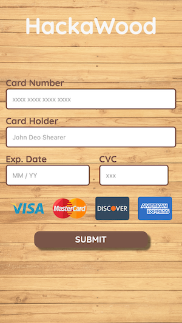
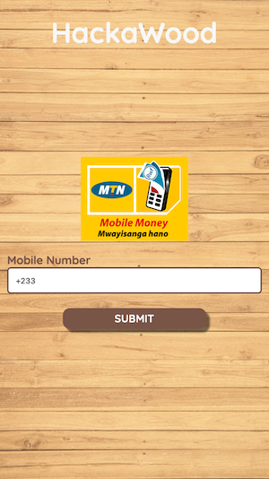
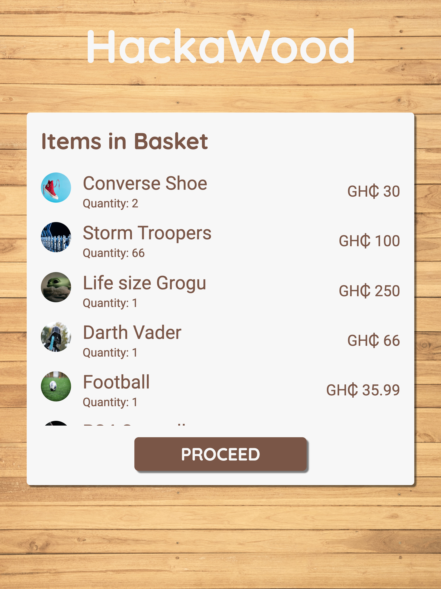
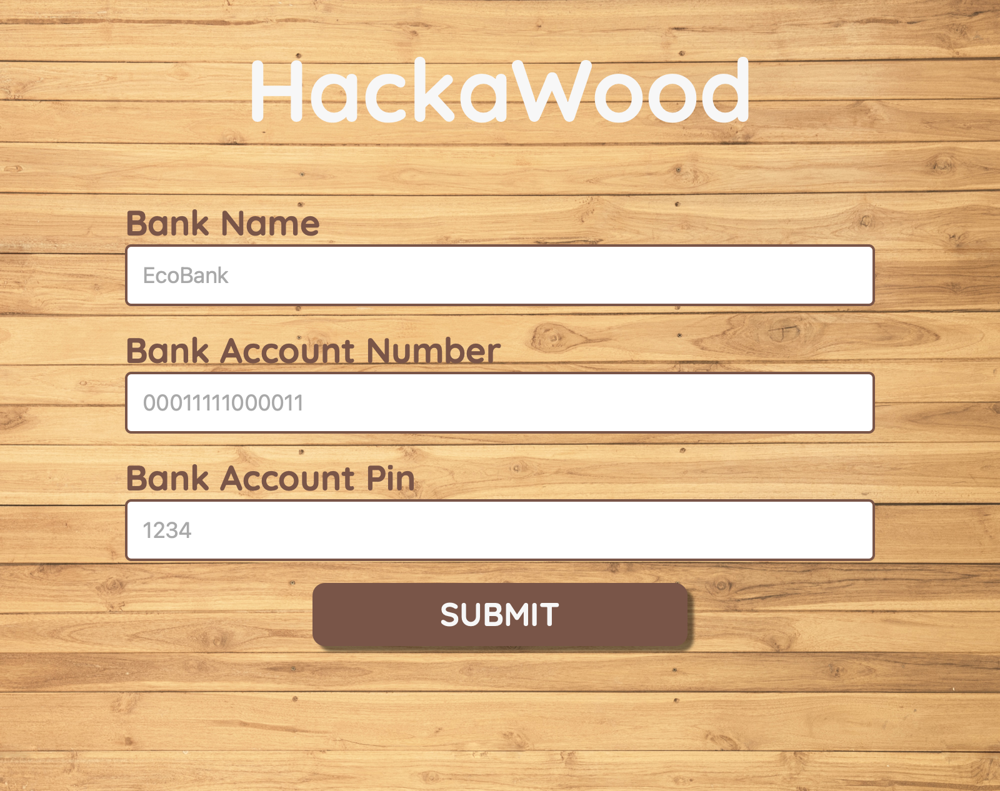

# Hackathon Checkout App _by_ Gerald Addo-Tetteh

This is the repository for a checkout web application; **HackaWood**, built with React and Express. The application uses the [PayBox](https://paybox.com.co). The application allows business owners to receive payments online through mobile money (MTN, Vodafone Cash), bank transactions and with a credit or debit card. The [PayBox](https://paybox.com.co) API provides more payment options such as crypto currency. The application is hosted on Heroku ([view page](https://hackawood.herokuapp.com)).

## Mobile Screenshots
<p align="center">
  
  
</p>

## Larger Screen Images


## Desktop Screenshots


# How to use HackaWood

1. Visit the hosted site [here](https://hackawood.herokuapp.com).
1. The home page shows items that have been added to the cart automatically.
1. Click on "Proceed" to continue.
1. You will be navigated to a page that asks you to choose your payment method. The methods available are MTN mobile money, Vodafone Cash and AirtelTigo.
1. You need to select a payment method before you can proceed.
1. The next screen will show you a form corresponding to the payment method to selected before.
1. With that you are done.

# How it Works

The application uses Express and node as the backend and React for the front-end.

#### Express Backend
The communication with the PayBox API occurs on the backend. There are three routes in total which send post requests to PayBox based on the selected payment option. They are: 
* Card (/payment/card)
* Mobile Money (/payment/mobile-money)
* Bank (/payment/bank)

  * The users payment credentials are sent to the backend as a JSON object.
  * The data is decoded using the express body parser.
  * The [request](https://github.com/request/request#readme) package was used to send post requests from the express server.

```javascript
// Express JSON body parser
app.use(express.json());

// Sending POST requests with "request"
const makeRequest = (req, res) => {
  const requestPath = req.body.path;
  const globalResponse = res;
  request.post(
    requestPath,
    {
      auth: {
        bearer: process.env.PAY_BOX_TOKEN,
      },
    },
    function completeRequest(err, res, body) {
      if (err) {
        globalResponse.status(400).end();
        return;
      }
      globalResponse.status(200).end();
    }
  );
};
```

From the request is authenticated using a bearer token.

#### React Frontend
Requests are sent to the express backend using the fetch API from the React.


```javascript
const useFetch = (setShowLoading, postUrl) => {
  const history = useHistory();
  const [, setShowSnackbar, , setSnackbarText] = useContext(SnackbarContext);
  const [url, setUrl] = useState(null);

  useEffect(() => {
    // abort controller
    const abortController = new AbortController();
    if (url) {
      fetch(postUrl, {
        signal: abortController.signal,
        method: "POST",
        body: JSON.stringify({
          path: url,
        }),
        headers: { "Content-Type": "application/json" },
      })
        .then((res) => {
          if (res.ok) {
            return res.text();
          }
          throw new Error("Could not complete transaction");
        })
        .then((_) => {
          setShowLoading(false);
          setSnackbarText("Transaction Complete");
          setShowSnackbar(true);
          history.push("/");
          setUrl(null);
        })
        .catch((err) => {
          setShowLoading(false);
          setSnackbarText(err.message);
          setShowSnackbar(true);
          setUrl(null);
        });
    }
    return () => abortController.abort();
  }, [url]);

  return setUrl;
};
```

The code above shows a custom Hook "useFetch". The Hook handles sending data to the backend and determining if the request was successful. The Hook requires two parameters "setShowLoading" and "postUrl". The first parameter is used to show or hide a loading widget. The second parameter is the URL that is used access the the PayBox API. The URL is built using the credentials the users entered and the mode of payment.

```javascript
const handleBuildUrl = () => {
  const orderId = (Math.random() * 1000).toFixed(0);
  const closedCardNumber = cardNumber.split(" ").join("");
  const closedCardExpiry = expirationDate.split(" ").join("");
  return `https://www.paybox.com.co/pay?amount=20.99&currency=GHS&mode=Card&card_type=${cardTypes[highlightCard]}&card_name=${cardHolder}&card_number=${closedCardNumber}&card_expiry=${closedCardExpiry}&card_cvc=${cvc}&payload={}&order_id=PB_${orderId}`;
};
```

The code above is specific to the card payment method.

## Dependencies
1. [dotenv](https://www.npmjs.com/package/dotenv)
1. [express](https://www.npmjs.com/package/express)
1. [request](https://www.npmjs.com/package/request#http-authentication)
1. [React](https://reactjs.org)
1. [payment](https://www.npmjs.com/package/payment)
1. [framer-motion](https://www.npmjs.com/package/framer-motion)
1. [react-loader-spinner](https://www.npmjs.com/package/react-loader-spinner)

---
##### Developer
* Email: addodevelop@gmail.com || gerald.tetteh@ashesi.edu.gh
* [Website](https://gerald-addo.herokuapp.com)
* [LinkedIn](https://www.linkedin.com/in/gerald-addo-tetteh-a28101182)